# 🐜 ANTS : Asset Navigation Trading Strategy
## 주린이 맞춤형 주식 추천 플랫폼

실시간 주식 데이터 시각화 및 사용자의 투자 성향에 따른 맞춤형 종목 추천 기능을 제공합니다.

---

## 프로젝트 기간

| 기간 | 내용 |
|-------|-------|
| 07/29 ~ 08/14 | 프로젝트 설계 |
| 08/08 ~ 08/14 | 서버 세팅, 협업 프로세스 구축 |
| 08/07 ~ 08/14 | 데이터 수집 |
| 08/13 ~ 08/20 | 파이프라인 구축 |
| 08/16 ~ 08/30 | 데이터 처리 및 분석 |
| 08/20 ~ 09/04 | 분석결과 해석 및 머신러닝 |
| 08/26 ~ 09/13 | 웹 개발 (백엔드, 프론트엔드) |
| 09/19 ~ 09/23 | CI/CD, 배포 |
| 09/23 ~ 09/25 | 최종점검 및 문서화 |

## Team Name : 개미마을 방범대

| 구성원 | 이메일주소 | 깃허브 주소 | 역할 |
|--------|----------|-----------|-------------|
| 원정인 | jeongin323@naver.com | [github](https://github.com/JeonginWon) | 프로젝트 매니저, 데이터 애널리스트, ML, 백엔드 |
| 최태성 | taesung1031@gmail.com | [github](https://github.com/xotjdchl) | AWS, git관리자, 데이터 애널리스트, ML, 백엔드 |
| 김예송 | yesong1250@gmail.com | [github](https://github.com/emfmfjd) | 데이터 엔지니어링, 프론트, 백엔드 |
| 차민혁 | alsgur1101@gmail.com | [github](https://github.com/alsgur1101) | 백엔드, 프론트, 데이터 엔지니어링 |
| 조명아 | linaauddk@naver.com | [github](https://github.com/linaauddk) | 도커 관리자, 데이터 엔지니어링, 백엔드, 프론트 |

## 서비스 개요

💸 " 주린이 맞춤 매칭 주식 플랫폼, ANTS "

PIR수치가 높은 한국 사회에서 자산의 파이프라인을 생성하고 관리하는 첫 시작을 돕고자 이 프로젝트를 기획하였습니다.

- 초보 투자자들이 투자에 대한 두려움을 줄이고, 실질적으로 투자에 필요한 사전 지식을 자연스럽게 습득할 수 있는 서비스 구현

- 주식 시장가격에만 매몰되는 것이 아닌 전체적인 시장과 경제의 흐름을 읽을 수 있도록 하는 주린이의 첫발걸음을 함께하는 플랫폼

## 서비스 주요기능

#### 1. 주식데이터 파이프라인

- 한국 투자 증권 openAPI 이용

- 실시간으로 주식 가격 정보와 거래 현황을 수집 및 처리하는 파이프라인을 구축.

- 하루 한번 주기적으로 주식 종가를 수집하고, 이동평균을 계산하는 파이프라인 구축.

- 주가변동상황을 종합적으로 보여주는 주가지수를 실시간으로 수집하는 파이프라인 구축  

#### 2. 주식 차트 시각화 (실시간 주식차트, 트리맵, 섹터별 급상승 급하락 차트, 종목지수 차트, 장단기 이동평균선) 구현

- 10분 단위로 실시간 주식 캔들차트,라인차트 업데이트

- 일정 기간 동안 주식 가격의 변동성을 확인할 수 있는 종가차트,장단기 이동평균선 구현

- 섹터별로 변동성이 큰 주식을 확인 할 수 있는 주요종목 실시간 트리맵구현 
- 주가 변동 사항을 나타내는 주가지수 차트 구현

✔️ 주식 데이터 시각화를 통해 사용자 친화적인 서비스를 제공합니다.

#### 3. 주식 관련 뉴스기사 정보 제공

- 네이버 뉴스검색 API 사용
- 종목 상세 페이지에서 주식과 관련된 현재 뉴스 기사 정보를 사용자에게 링크와 함께 제공 

✔️ 실시간 뉴스 업데이트를 통해 사용자는 최신 주식 동향을 빠르게 파악할 수 있습니다.

#### 4. 주린이 투자성향 기반 주식MBTI 매칭 시스템 

- 주린이 투자 성향을 분석하여 적합한 주식 종목을 추천합니다. 
- 핵심 과정:
   1) 주식 MBTI (FACTOR 기반): 주식 종목을 4가지 특성인 안정성, 성장성, 수익성, 활동성에 따라 k-means 클러스터링하여 16가지 주식 MBTI로 그룹화.

   2) 사용자 투자 성향 TEST : 사용자가 입력한 데이터를 바탕으로 투자 성향을 진단하고 사용자 유형을 분류.

✔️ TEST결과를 바탕으로 Mypage에서 사용자의 투자성향에 따라 적합한 성격의 주식MBTI를 매칭하고 관련 주식종목을 추천합니다.

#### 5. 주식 배당성 분석 및 배당률 예측 시스템
   
- 주식 종목의 배당성과 변동성을 분석하고, 종목의 배당률을 예측하여 사용자의 투자 전략 수립에 도움을 줍니다.
- 핵심 과정:
  1) 배당성 : 각 주식 종목의 최근 6년간의 배당률, 배당성향 등의 데이터를 기반으로 k-means 클러스터링하여 주식 종목을 3단계로 분류하여 그룹화.

  2) 변동성 : 각 주식 종목의 52주간의 최고가, 최저가, 거래량 회전율, 시가총액 등의 데이터를 기반으로 k-means 클러스터링하여 주식 종목을 2단계로 분류하여 그룹화.

  3) 배당률 예측 : 각 주식의 최근 9년간의 배당률, 매출액증가율, 영업이익증가율, 주당순이익증가율 등의 데이터를 기반으로 random forest 회귀 모델을 사용하여 배당률을 예측.

✔️ 배당성, 변동성, 예측 배당률의 정보를 주식 종목 상세페이지에서 확인할 수 있습니다.

#### 6. 주린이를 위한 기초 경제 용어 사전
- 기획재정부_시사경제용어 정보데이터를 이용해 기초 경제 용어 검색 기능 추가

✔️ 경제 용어 사전 기능으로 초보 투자자도 주식 및 경제 정보를 쉽게 이해할 수 있도록 돕습니다.

## 사용기술
---

- language : Python, Javascript, SQL
- FrontEnd : Chart.js, Plotly.js, HTML/CSS
- BackEnd : Django, Nginx, Gunicorn
- DataEngineering : Apache Airflow, AWS Lambda
- DataAnalysis, MachineLearning : K-Means, Regression
- Infra : Docker
- CI/CD : Github Actions
- Storage : MySQL, RDS, S3

## 사용데이터
---
- 한국 투자증권 api
- koscom datamall - 일별 주가지수 
- 기획재정부_시사경제용어 정보데이터
- KRX 정보데이터시스템 - 상장된 종목명 및 종목코드, 종목 배당 정보
- FNGudie 재무재표, 재무비율 크롤링

## ERD
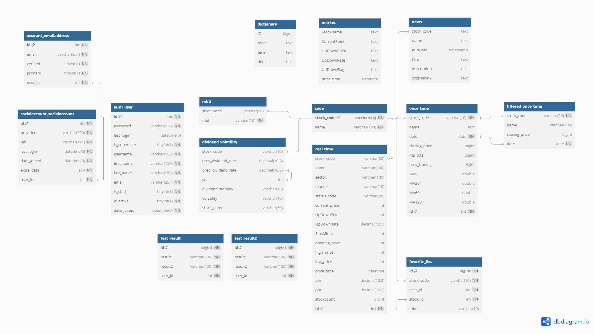
---

## 전체 아키텍처
---
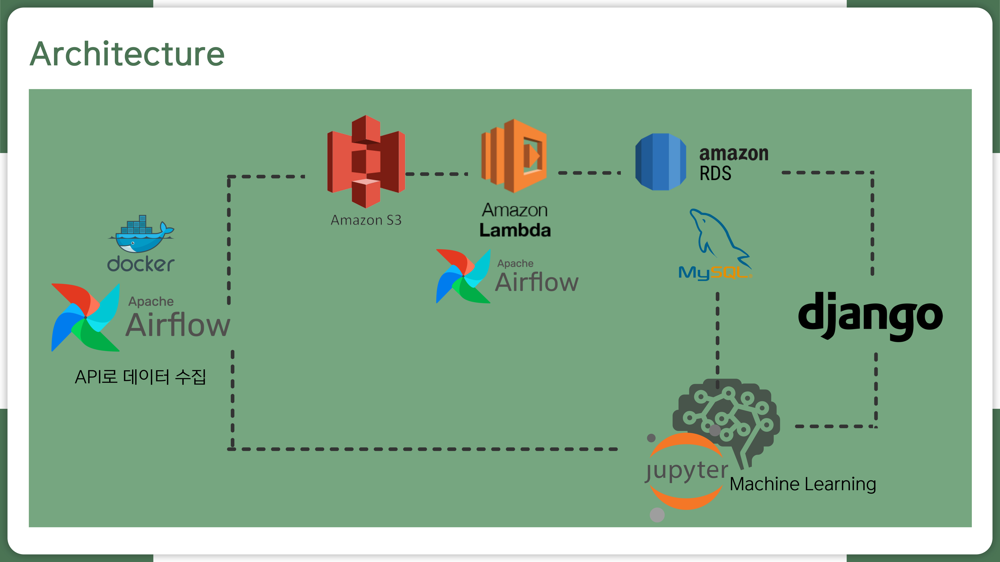

### 데이터 수집
Airflow : Docker compose를 이용한 Airflow환경설정
- API로 주식데이터를 10분 단위로 9시부터 4시까지 스케줄링하여 데이터 수집
- 네이버 API로 뉴스검색 데이터를 3시간 단위로 매일 수집

### 데이터 저장
- S3 (Data Lake) : AWS 환경에 실시간 주식 raw데이터 적재(csv)
- MySQL DB , RDS (DataWarehouse) : lambda(or Airflow)로 전처리가 진행된 데이터 저장, 저장된 데이터로 프론트와 백엔드 구현

### 데이터 전처리, ETL
lambda : raw데이터가 갱신될 때마다 자동으로 전처리 및 DB에 저장

### 데이터 시각화, 차트구현

1.chart.js를 이용한 주식 차트 시각화:

  - 실시간 주식 데이터와 과거 데이터를 기반으로 캔들스틱 차트와 라인 차트를 구현.
  - 1일 차트는 실시간 데이터를 사용하며, 캔들스틱 차트로 주식의 변동률을 시각화.
  - 장기 데이터(1년, 5년, 10년)는 라인 차트를 사용해 주식의 변동 추이를 시각화.
  - 사용자는 1일, 1년, 5년, 10년 등의 기간을 선택해 차트를 조회할 수 있으며, 선택한 기간에 따라 다른 형태의 차트를 볼 수 있음.

2.plotly.js를 이용한 트리맵 구현:

- KOSPI 및 KOSDAQ의 주식 데이터를 바탕으로 트리맵을 시각화.
- 주식 섹터별 그룹화와 상승/하락 종목을 색상으로 구분하여 한눈에 변동성을 파악할 수 있도록 함.
- 사용자는 1일, 1주, 1개월, 3개월, 6개월, 1년 기간 중 선택해 트리맵을 조회할 수 있음.

### 데이터 분석 $ Machine Learning
- Python, Jupyter, VS Code : 로컬 환경에서 진행
- K-means, Regression

### 웹 개발 
- Django : 제공 인증 시스템을 사용하여, 로그인/로그아웃 기능 및 사용자별 권한 관리
- OAuth를 통해 Google 계정으로 로그인할 수 있도록 소셜 로그인 기능 추가
- ORM(Object-Relational Mapping)을 사용하여 MySQL 데이터베이스와의 효율적인 통신 구현
- 네이버 뉴스 API를 사용하여 주식과 관련된 최신 뉴스를 실시간으로 사용자에게 제공
- 사용자가 클릭할 수 있는 뉴스 목록과 링크를 동적으로 로딩
- Gunicorn과 NGINX를 함께 사용하여, 요청 처리의 안정성 및 성능을 향상
- Github Actions을 사용해 지속적인 통합 및 배포(CI/CD) 자동화 구현

# 엔지니어링 파이프라인
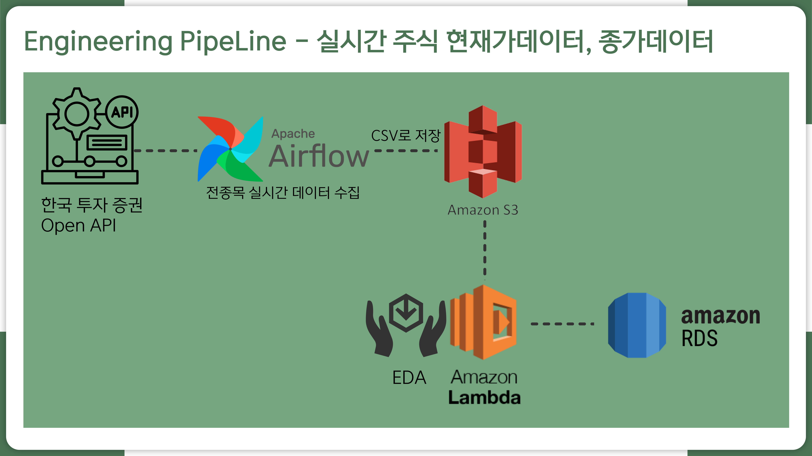
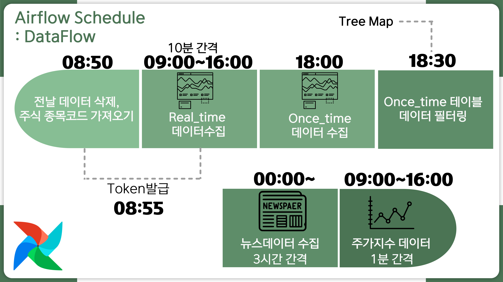
1. 실시간 데이터 파이프라인

한국투자증권 API -> airflow로 전종목 실시간 데이터 수집 -> S3에 csv 저장 -> lambda로 필요한 데이터만 전처리 -> RDS에 적재
- 평일 9시부터 4시 전까지 10분 간격으로 주가 데이터 갱신
- 받아온 데이터에 주식코드 추가하여 csv로 S3 저장
- lambda로 필요한 컬럼만 선별 / rds에 적재

2. 종가 데이터 파이프라인

한국투자증권 API -> airflow로 전종목 종가 데이터 수집 -> S3에 csv 저장, 전처리 후 RDS에 적재, RDS에 있는 데이터로 이동평균 계산 후 업데이트
- 매일 오후 6시 1번 실행
- 받아온 데이터에 주식코드 추가하여 csv로 S3 저장
- 그 후 airflow task로 필요한 컬럼만 선별, RDS 적재
- RDS에 있는 데이터를 활용해서 이동평균 계산 및 RDS 업데이트

# Machine Learning 모델 학습 파이프라인

1. 주식 종목 MBTI 분류 및 투자성향과 매칭 시스템 (K-means Clustering)
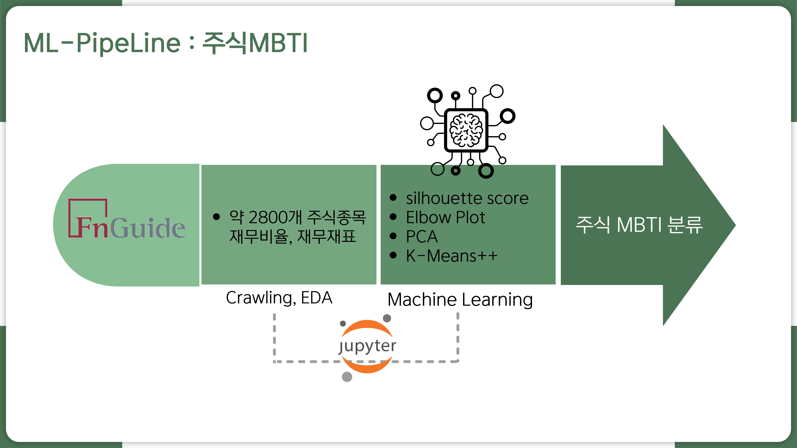
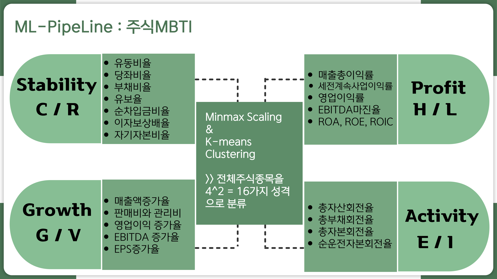

목적: 주식의 안정성, 수익성, 성장성, 활동성이라는 4가지 요인을 바탕으로 주식을 MBTI 성격 유형처럼 분류하여 투자자들에게 맞춤형 투자 정보를 제공하고, 주식 선택의 다양성과 이해도를 높이는 것을 목표로 합니다.
- 주식을 4가지 핵심 요인을 기준으로 분석하여 유형화.
- 투자자들에게 주식의 성격을 직관적으로 이해할 수 있는 도구 제공.
- 투자 스타일과 주식 성격의 매칭 시스템 개발.

2. 배당률 예측 모델 학습 (Regression RandomForest)
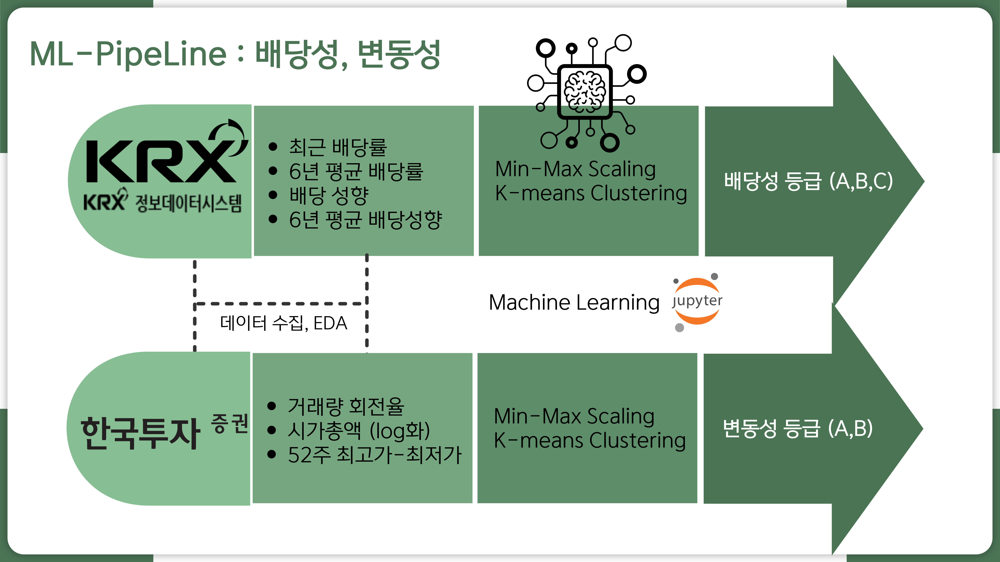
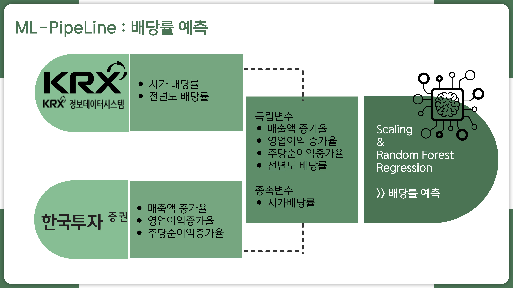

   - 참고문헌 : Jae Kwon Bae. (2019). A Study on the Predictability of Dividend Policy Using Artificial Intelligence Techniques. The e-Business Studies, Volume 20, Number 7, December, 201-216.

---
# WEB 프로토타입

# WEB 구현 페이지 (백엔드, 프론트엔드)
- 메인 페이지
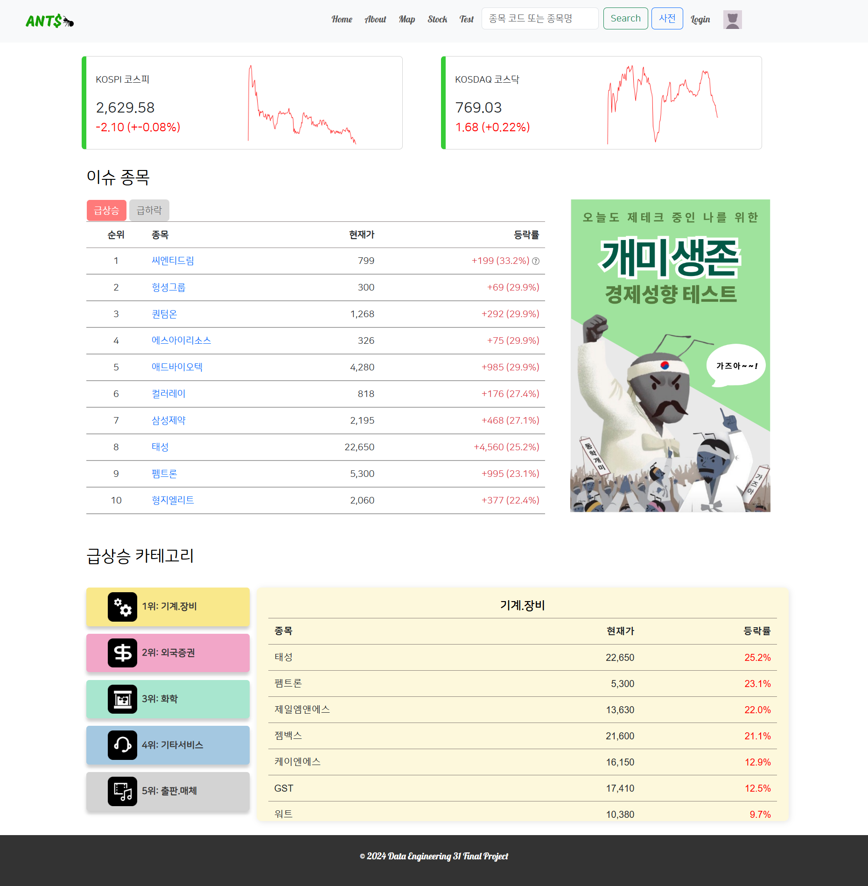
- 경제 용어 사전 검색 기능
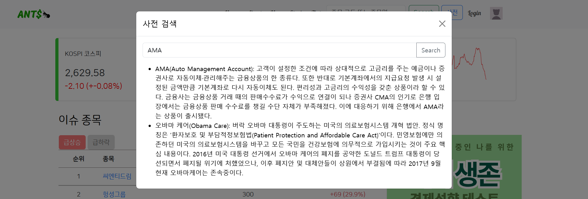
- about 페이지

- 트리맵 페이지
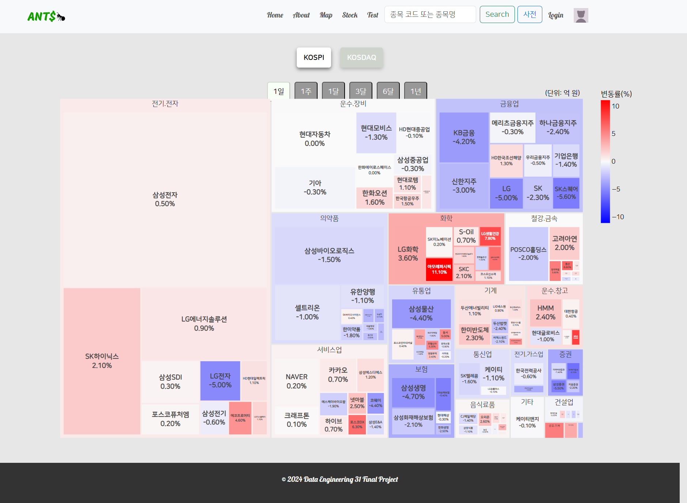
- 주식 종목 개별 페이지
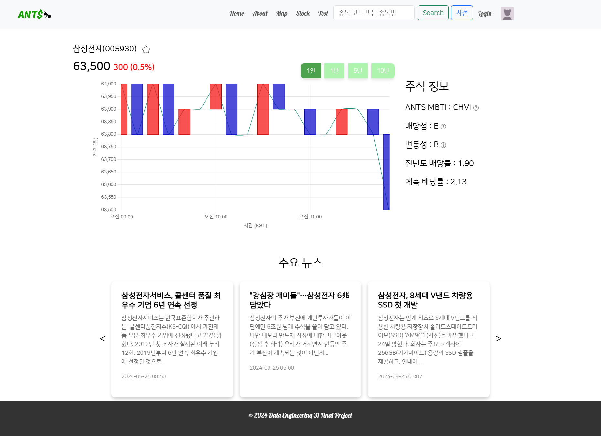
- 테스트 시작 페이지
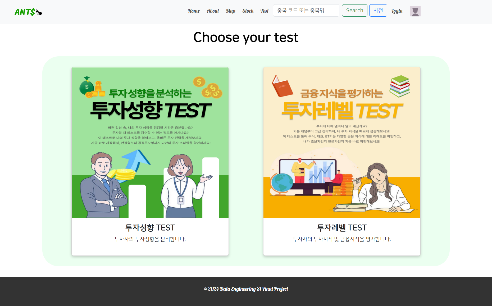
- 테스트 페이지
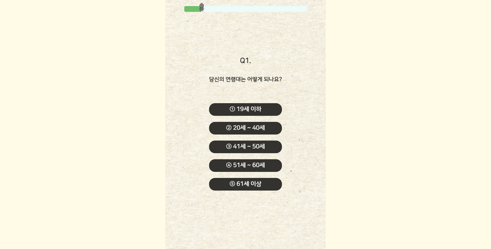
- 로그인 페이지

- 마이 페이지
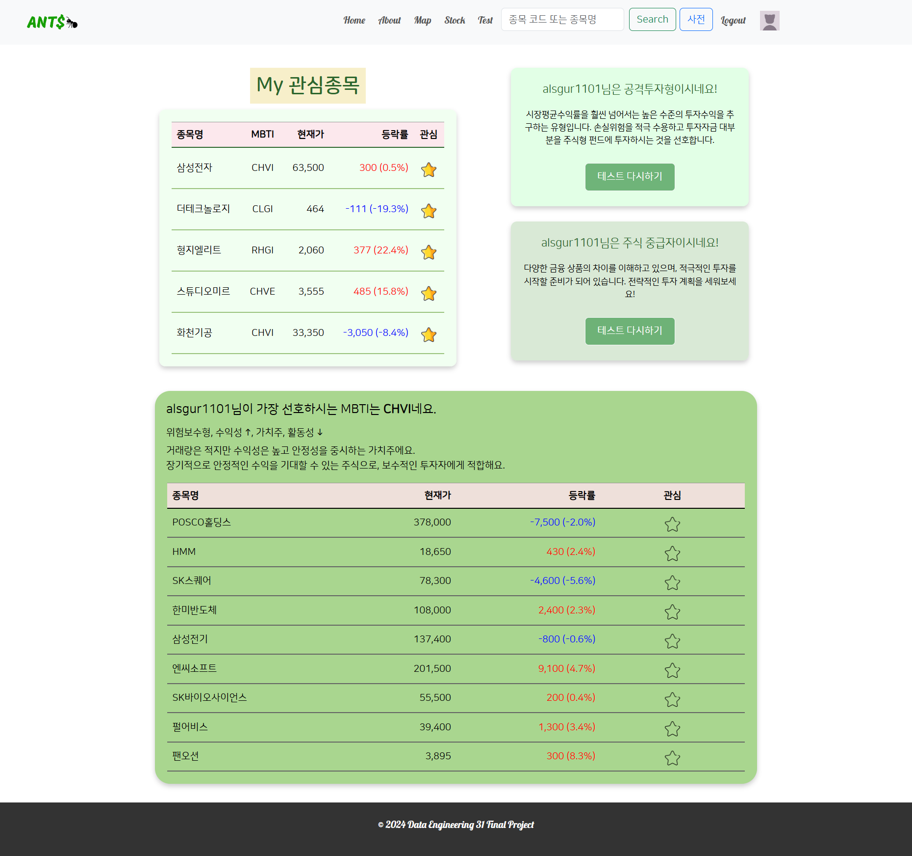

---

# 시연영상
[시연영상](https://drive.google.com/file/d/1fNnHcH3vmnOjGkxnWeYETAmic39iLO6e/view?usp=drive_link)

# 요구사항 명세서
[요구사항명세서](개미마을방범대_documents/개미마을방범대_요구사항명세서.xlsx)
[요구사항 명세서](https://docs.google.com/spreadsheets/d/1SnQLOL8U4jyd8TX5Kd-K9cMWcNk-OtMJ/edit?gid=1993544325#gid=1993544325)

# WBS
[WBS](개미마을방범대_documents/개미마을방범대_WBS.xlsx)
[WBS](https://docs.google.com/spreadsheets/d/1Q2K3BLbZAF3vxTPlImWbszM_Kf0bg2SI/edit?gid=730338524#gid=730338524)

# 발표PPT
[발표자료_ppt](개미마을방범대_documents/개미마을방범대_ppt-20240926T012833Z-001.zip)
[발표자료_pdf](개미마을방범대_documents/개미마을방범대_PPT.pdf)

