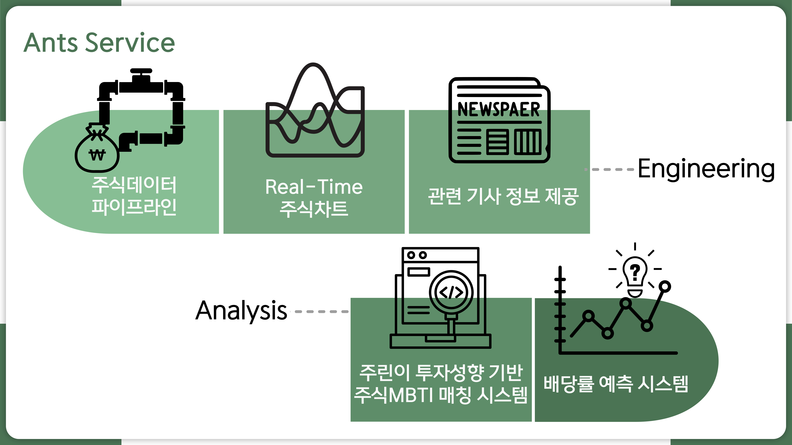
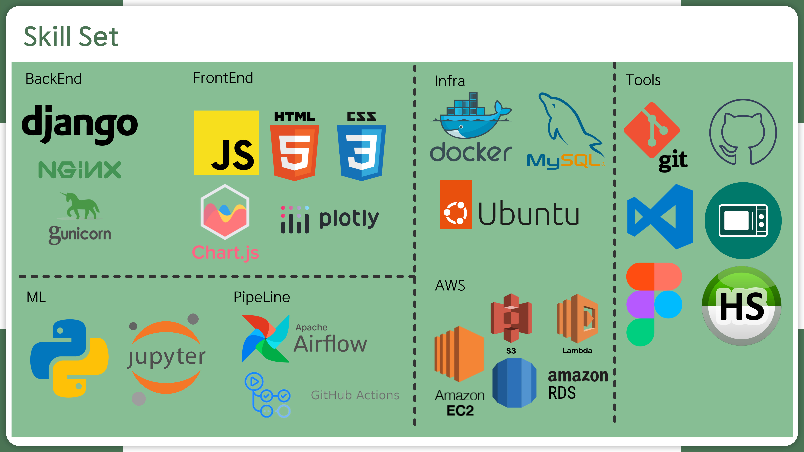

# 🐜 ANTS : Asset Navigation Trading Strategy
## 주린이 맞춤형 주식 추천 플랫폼

실시간 주식 데이터 시각화 및 사용자의 투자 성향에 따른 맞춤형 종목 추천 기능을 제공합니다.

---

## 프로젝트 기간

| 기간 | 내용 |
|-------|-------|
| 07/29 ~ 08/14 | 프로젝트 설계 |
| 08/08 ~ 08/14 | 서버 세팅, 협업 프로세스 구축 |
| 08/07 ~ 08/14 | 데이터 수집 |
| 08/13 ~ 08/20 | 파이프라인 구축 |
| 08/16 ~ 08/30 | 데이터 처리 및 분석 |
| 08/20 ~ 09/04 | 분석결과 해석 및 머신러닝 |
| 08/26 ~ 09/13 | 웹 개발 (백엔드, 프론트엔드) |
| 09/19 ~ 09/23 | CI/CD, 배포 |
| 09/23 ~ 09/25 | 최종점검 및 문서화 |

## 프로젝트 구성원

Team Name : 개미마을 방범대

| 구성원 | 이메일주소 | 깃허브 주소 | 역할 |
|--------|----------|-----------|-------------|
| 원정인 | jeongin323@naver.com | [github](https://github.com/JeonginWon) | 프로젝트 매니저, 데이터 애널리스트, ML, 백엔드 |
| 최태성 | taesung1031@gmail.com | [github](https://github.com/xotjdchl) | AWS, git관리자, 데이터 애널리스트, ML, 백엔드 |
| 김예송 | yesong1250@gmail.com | [github](https://github.com/emfmfjd) | 데이터 엔지니어링, 프론트, 백엔드 |
| 차민혁 | alsgur1101@gmail.com | [github](https://github.com/alsgur1101) | 백엔드, 프론트, 데이터 엔지니어링 |
| 조명아 | linaauddk@naver.com | [github](https://github.com/linaauddk) | 도커 관리자, 데이터 엔지니어링, 백엔드, 프론트 |

## 서비스 개요

💸 " 주린이 맞춤 매칭 주식 플랫폼, ANTS "

PIR수치가 높은 한국 사회에서 자산의 파이프라인을 생성하고 관리하는 첫 시작을 돕고자 이 프로젝트를 기획하였습니다.

- 초보 투자자들이 투자에 대한 두려움을 줄이고, 실질적으로 투자에 필요한 사전 지식을 자연스럽게 습득할 수 있는 서비스 구현

- 주식 시장가격에만 매몰되는 것이 아닌 전체적인 시장과 경제의 흐름을 읽을 수 있도록 하는 주린이의 첫발걸음을 함께하는 플랫폼

## 서비스 주요기능

1. Real-Time 주식데이터 파이프라인

- 실시간으로 주식 가격 정보와 거래 현황을 수집 및 처리하는 파이프라인을 구축.

2. Real-Time 주식 차트 (트리맵, 섹터별 급상승 급하락 차트, 종목지수 차트, 장단기 이동평균선 ) 구현 

- 사용자 친화적인 대시보드를 통해 주식 데이터 시각화
- 10분단위로 데이터 및 차트 업데이트

3. 주식 관련 뉴스기사 정보 제공

- 네이버 뉴스검색 API 사용
- 종목 상세 페이지에서 주식과 관련된 현재 뉴스 기사 정보를 사용자에게 링크와 함께 제공합니다. 

4. 주린이 투자성향 기반 주식MBTI 매칭 시스템 

- 주린이 투자 성향을 분석하여 적합한 주식 종목을 추천합니다. 
- 핵심 과정:
1) 주식 MBTI (FACTOR 기반): 주식 종목을 4가지 특성인 안정성, 성장성, 수익성, 활동성에 따라 k-means 클러스터링하여 16가지 주식 MBTI로 그룹화.

2) 사용자 투자 성향 TEST : 사용자가 입력한 데이터를 바탕으로 투자 성향을 진단하고 사용자 유형을 분류.

✔️ TEST결과를 바탕으로 Mypage에서 사용자의 투자성향에 따라 적합한 성격의 주식MBTI를 매칭하고 관련 주식종목을 추천합니다.

5. 주식 배당성 분석 및 배당률 예측 시스템
   
- 주식 종목의 배당성과 변동성을 분석하고, 종목의 배당률을 예측하여 사용자의 투자 전략 수립에 도움을 줍니다.
- 핵심 과정:
  1) 배당성 : 각 주식 종목의 최근 6년간의 배당률, 배당성향 등의 데이터를 기반으로 k-means 클러스터링하여 주식 종목을 3단계로 분류하여 그룹화.

  2) 변동성 : 각 주식 종목의 52주간의 최고가, 최저가, 거래량 회전율, 시가총액 등의 데이터를 기반으로 k-means 클러스터링하여 주식 종목을 2단계로 분류하여 그룹화.

  3) 배당률 예측 : 각 주식의 최근 9년간의 배당률, 매출액증가율, 영업이익증가율, 주당순이익증가율 등의 데이터를 기반으로 random forest 회귀 모델을 사용하여 배당률을 예측.

✔️ 배당성, 변동성, 예측 배당률의 정보를 주식 종목 상세페이지에서 확인할 수 있습니다.

## 사용기술
---

- language : Python, Javascript, SQL
- FrontEnd : Chart.js, Plotly.js, HTML/CSS
- BackEnd : Django, Nginx, Gunicorn
- DataEngineering : Apache Airflow, AWS Lambda
- DataAnalysis, MachineLearning : K-Means, Regression
- Infra : Docker
- CI/CD : Github Actions
- Storage : MySQL, RDS, S3

## 사용데이터
---

## ERD
---

## 전체 아키텍처
---

